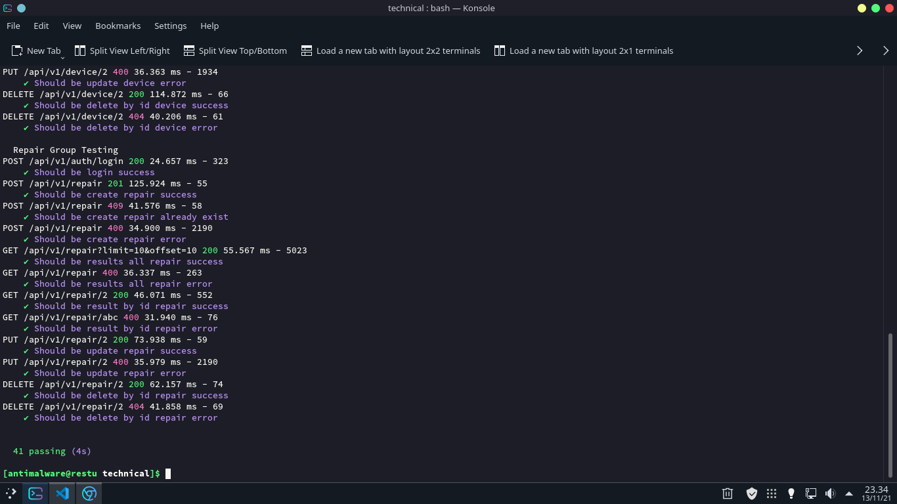

# Tecnical Test

Tecnical Test from PT.Sun Artha Putra Mandiri for Junior Backend Developer Position.

## Note

Before you run this app you must run migration database, after migration you can test this app, with importing **sunartha_task.postman_collection.json** into your postman.

## Lifecycle Environment

- ### Application Environment

  - **Development Mode**

  ```sh
  npm run dev || make dev
  ```
  - **Production Mode**

  ```sh
  npm start || make prod
  ```
  - **Testing Mode**

  ```sh
  npm test || make test
  ```
  - **Build Application**

  ```sh
  npm run build || make build
  ```

- ### Database Environment

  - **Latest Or Rollback Database Migration**

  ```sh
  npm run kmig || npm run kroll || make kmig type=<latest | rollback>
  ```
  - **List Migration Database**

  ```sh
  npm run klist || npm run kroll || make klist
  ```
  - **Run Seed Database**

  ```sh
  npm run krun || make krun
  ```
  - **Created Seed Database**

  ```sh
  npx knex --cwd src --knexfile knexfile seed:make <seed db name> || make kmakes name=<seed db name>
  ```
  - **Created Migration Database**

  ```sh
  npx knex --cwd src --knexfile knexfile migrate:make <migration db name> || make kmakem name=<migration db name>
  ```

  - **Latest Or Rollback Database Migration Inside Docker**

  ```sh
  docker-compose exec app npm run kmig ||  docker-compose exec app npm run kroll || make kdoc type=<migration db name>
  ```

  - **Run Seed Database Inside Docker**

  ```sh
  docker-compose exec app npm run krun || make krun 

- ### Docker Environment

  - **Docker Compose Up**

  ```sh
  docker-compose up -d --build || make dcu
  ```
  - **Docker Compose Down**

  ```sh
  docker-compose down || make dcd
  ```

## Test Driven Development 100% Pass

